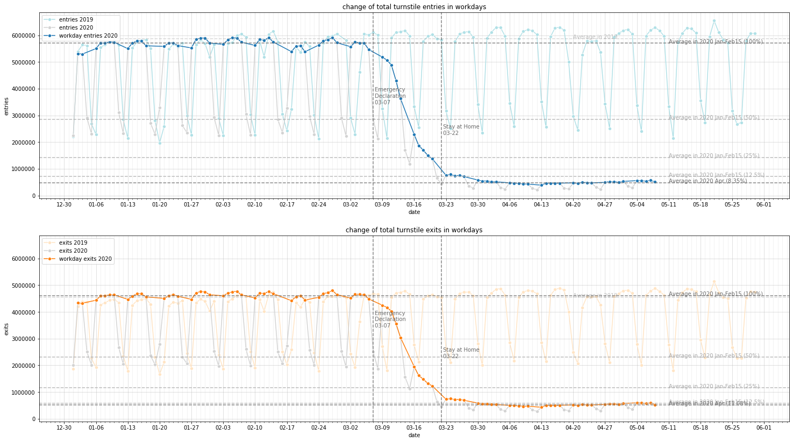
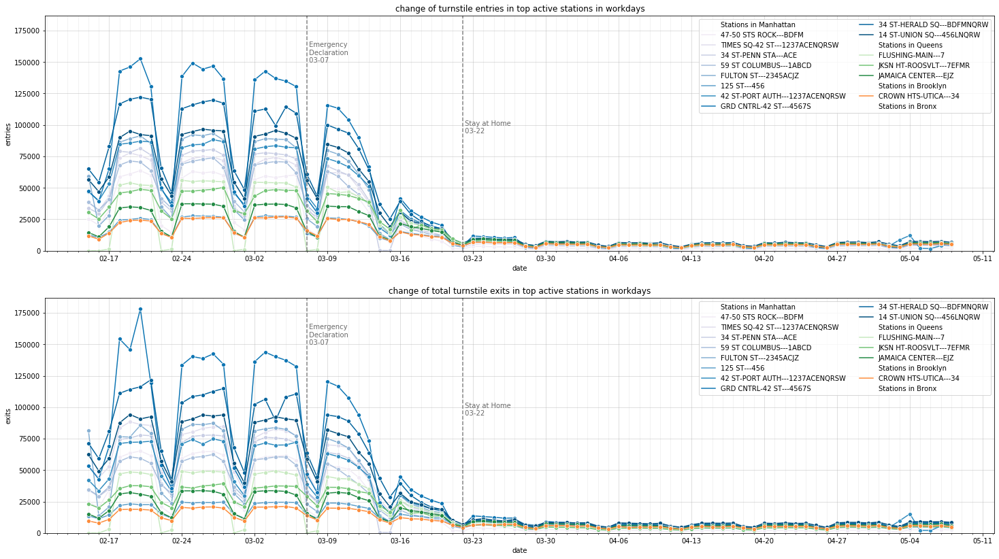
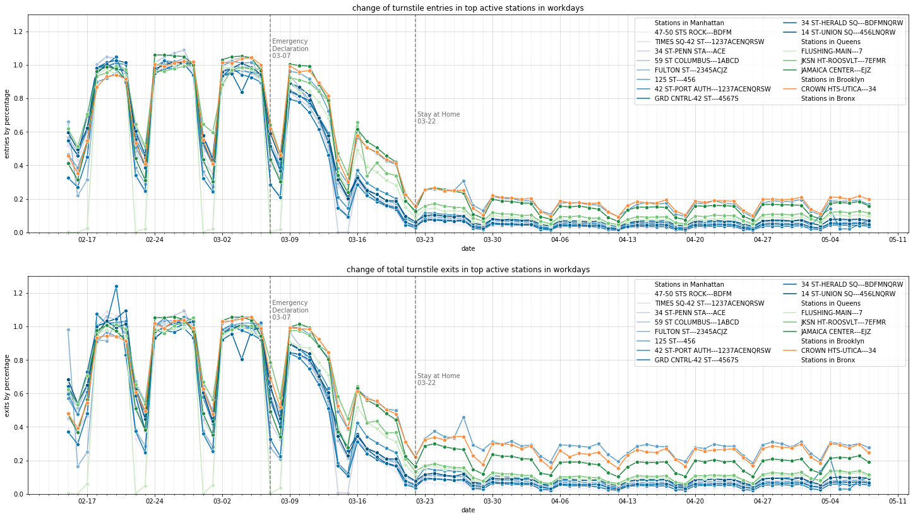
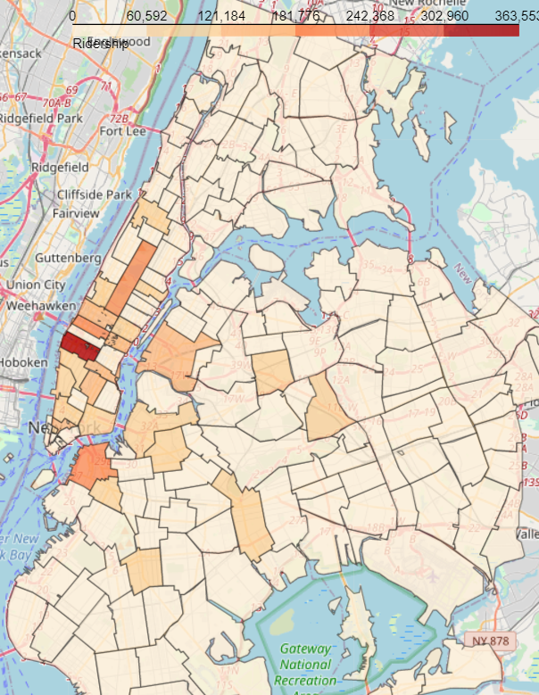
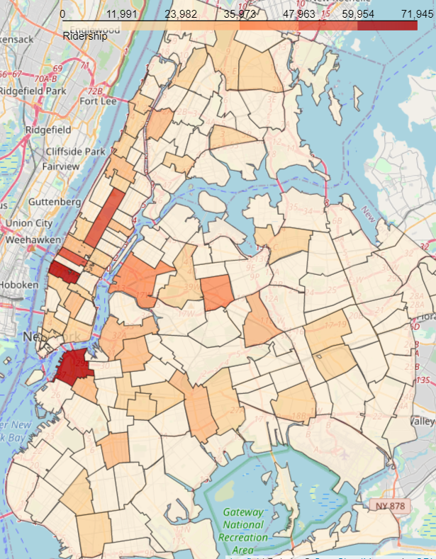
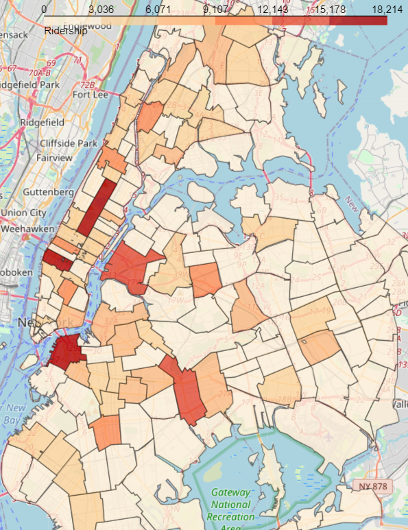
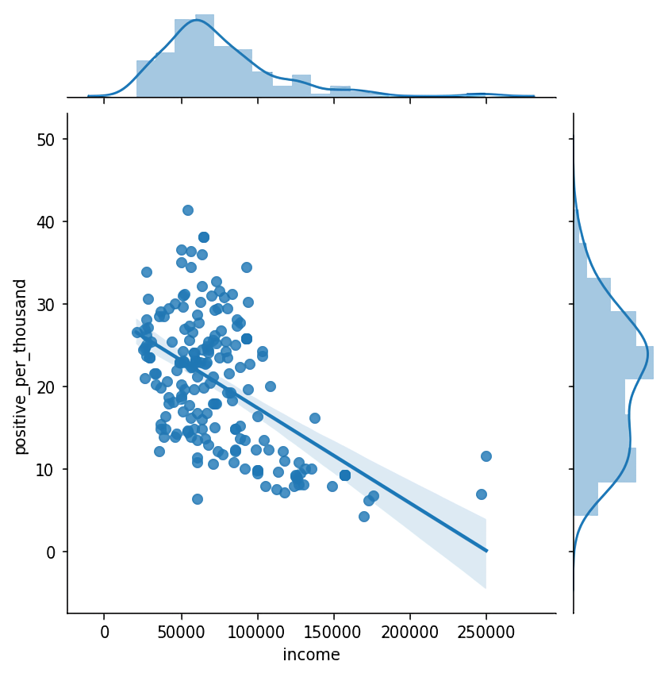
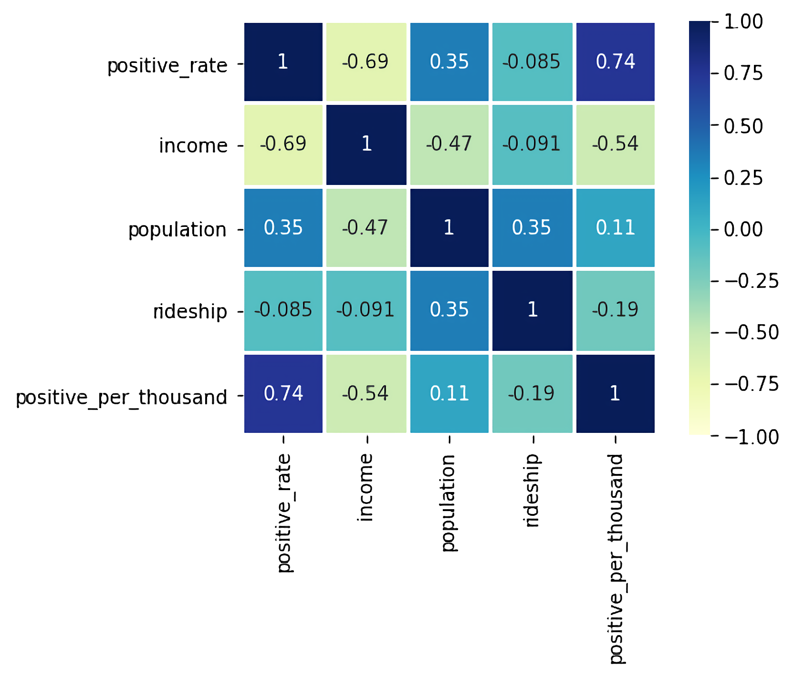

# BigData2020 Project

### Project Link

https://github.com/mahouoji/MobilityChange

## Group Name

subwayNYC

## Project Participants

Bangwen Sun (bs3845)

Hang Dong (hd1191)

Yunxiao Shi (ys3404)

## Project Description

In respond to the pandemic, mobility in cities changed drastically under administrative restriction and voluntary behavior change. Resent studies [1, 3] quantified state-level or country-level mobility change using mobility statistics. Within New York City, traffic volume and public transportation usage has dropped, while different neighborhoods may respond differently [2].

In this project we will use MTA turnstile data, along with other datasets, to analyze the mobility change in terms of subway ridership in different areas of NYC.

### Problems

- How does mobility change over time? How does stat-at-home policies affect the trends?
- Dose mobility change show different patterns in different areas?
- How does subway ridership correlate to other matrices such as confirmed cases?

### Approaches

We use MTA Turnstile Usage Data because it is updated frequently and has a granularity suitable for our analysis of daily mobility changes in small areas. We will first clean and process raw turnstile data into subway ridership by station per day. We may select those stations with higher number of traffic and compare the number after the outbreak with that in previous months or in previous years.  We can visualize ridership over time using line chart and see if the trend correspond to important dates regarding the pandemic. Our result may be used to validate the results of [1] and [3].

To demonstrate the mobility changes in different urban area, we will integrate ridership data and MTA Station Location data. Because the documentary format of station names may differ in these data sets, we will figure out the similarity of names using edit distance. We will visualize ridership and the percentage of ridership change using dot map for each staton and choropleth map for aggregated regions. The latter allows us to compare our result with other figures of different spacial granularity, for example, confirmed cases by zip code or borough. We will do spacial aggregation on stations and implement quad tree index.

Based on the result of the above steps, we might need to delve into more detailed information. For example, grouping subway ridership data by lines or time periods in one day. We may also refer to other datasets, such as MTA Fare Data for different card types, to see if we can have better understanding of the rider population. As complement to subway traffic, we might use data from other transportation systems like citibike and MTA bridge and tunnel usage. Since those data are aggregated and uploaded by various time span, we will need to aggregate turnstile data by week or month accordingly.

We will use Python and Jupyter Notebook in this project. We will use packages  such as NumPy, pandas, GeoPandas, Matplotlib, and seaborn.

## List of Dataset

| Dataset                                                      | Description                                                  |
| ------------------------------------------------------------ | ------------------------------------------------------------ |
| [MTA Turnstile Usage Data](http://web.mta.info/developers/turnstile.html) | Weekly released cumulative entrance and exit count of each turnstile for each record datetime, also contains station name and line names. For each week, there is a CSV formatted text file, with header: <br />**C/A,UNIT,SCP,STATION,LINENAME,DIVISION,DATE,TIME,DESC,ENTRIES,EXITS**<br />C/A – The Control Area is the operator booth in a station. Some stations only have one operator booth. However, larger stations may have more than one.<br />UNIT – The Remote Unit, which is the collection of turnstiles. A station may have more than one Remote Unit.<br />SCP – The Subunit Channel Position represents the turnstile and the number used may repeat across stations. The **UNIT and SCP together is a unique identifier of a turnstile**.<br />STATION - Name of station, e.g. "59 ST"<br />LINENAME - Lines, e.g. "NQR456W"<br />DATE – The Date is the date of the recording with the format MM/DD/YYYY.<br />TIME – The Time is the time for a recording, with the format: HH:MM:SS.<br />DESC – The DESC is the type of event of the reading. **The turnstiles submit “Regular” readings every four hours.** They stagger the exact time of the readings across all the turnstiles and stations. Staggering the data submission times avoids having all the turnstiles update at simultaneously. “Recover Audit” designates scheduled readings taken after a communication outage. Other values such as “DoorClose” and “DoorOpen” represent unscheduled maintenance readings.<br />ENTRIES - The ENTRIES are a cumulative count of turnstile entrances. Note, the ENTRIES do not reset each day or for each recording period. **The turnstile entry count continues to increase until it reaches the device limit and then resets to zero.**<br />EXITS - The EXITS are a cumulative count of the turnstile exits. |
| [MTA Station Locations](http://web.mta.info/developers/data/nyct/subway/Stations.csv) | Latitude and longitude of subway stations, also contains stop name, line names, direction labels etc. |
| [Station Locations](https://github.com/chriswhong/nycturnstiles/blob/master/geocoded.csv) | Unofficial latitude and longitude of subway stations, updated on 4/23/2013.<br />Header: remote unit, control area, station, lines, division, latitude, longitude |
| [MTA Fare Data](http://web.mta.info/developers/fare.html)    | The number of MetroCard swipes made each week by customers entering each station of the New York City Subway, PATH, AirTrain JFK and the Roosevelt Island Tram, broken out to show the relative popularity of the various types of MetroCards. MTA New York City Transit posts the latest data every Saturday by 1 a.m., and the dates listed in the links reference the date the data is posted. The data in the files covers seven-day periods beginning on the Saturday two weeks prior to the posting date and ending on the following Friday. |
| [Hourly Traffic on MTA Bridges and Tunnels](https://data.ny.gov/Transportation/Hourly-Traffic-on-Metropolitan-Transportation-Auth/qzve-kjga) | The number of vehicles (including cars, buses, trucks and motorcycles) that pass through each of the bridges and tunnels operated by the MTA each hour of the day. The data is updated weekly. |
| [Daily Traffic on MTA Bridges and Tunnels](http://web.mta.info/developers/data/bandt/trafficdata.html) | The number of vehicles (including cars, buses, trucks and motorcycles) that pass through each of the nine bridges and tunnels operated by the MTA each day. XML formatted. Uploaded each week. |
| [FHV Base Aggregate Report](https://data.cityofnewyork.us/Transportation/FHV-Base-Aggregate-Report/2v9c-2k7f) | Monthly report including weekly total dispatched trips and unique dispatched vehicles by base tabulated from FHV Trip Record submissions made by bases. Note: The TLC publishes base trip record data as submitted by the bases, and we cannot guarantee or confirm their accuracy or completeness. Therefore, this may not represent the total amount of trips dispatched by all TLC-licensed bases. The TLC performs routine reviews of the records and takes enforcement actions when necessary to ensure, to the extent possible, complete and accurate information. |
| [Citi Bike Trip History](https://s3.amazonaws.com/tripdata/index.html) | Citi Bike trip data, with latitude and longitude of start and end station. Updated monthly. (-March 2020) |
| [NYC COVID-19 Data](https://github.com/nychealth/coronavirus-data) | NYC coronavirus dataassembled by the NYC Department of Health and Mental Hygiene. <br />boro.csv - rates of confirmed cases by NYC borough of residence.<br />tests-by-zcta.csv - cumulative test and test positive count of NYC residents by ZIP code |
|                                                              |                                                              |

## Data Cleaning and Integration

### Turnstile Data Preprocessing

Turnstile data contains 11 fields:
C/A, UNIT, SCP, STATION, LINENAME, DIVISION, DATE, TIME, DESC, ENTRIES, EXITS

To summarize the ridership of each station for a certain time e.g. one week, four specified fields should be focused:
STATION: Represents the station name the device is located at
DIVISION: Represents the Line originally the station belonged to BMT, IRT, or IND
ENTRIES: The cumulative entry register value for a device
EXITS: The cumulative exit register value for a device

Because two stations may have the same name in different transit agencies, (e.g. IND 103 St, IRT 103 St), station and division name should both be used as the primary key to define a specific station. Next, combine the records of ENTRIES and EXITS together and calculate the sum for each station. Thus, the ridership of each station in a period can be calculated.


Station data contains 13 fields:
Station ID, Complex ID, GTFS Stop ID, Division, Line, Stop Name, Borough, Daytime Routes, Structure, GTFS Latitude, GTFS Longitude, North Direction Label, South Direction Label

Only station names and GTFS locations are useful for calculating the location. Some traffic hubs have several entrances for different lines, and their geographical positions are close. Thus, average values of latitude and longitude would be calculated to represent the location of these huge stations.

It still requires some processes before the integration of these two data sets because the syntax of station names might be different (e.g. Grand St, grand street). By translating station names to lower cases and conduct the inner join based on Division and Station names, the dataset containing stations with same name in two sets can be figured out.

Next step will be calculating the similarity of station names using edit distance for these stations which cannot make a pair. Refer to ```./data_cleaning/turntile/MTADataIntegration.ipynb``` for details.

### MTA Turnstile Usage

##### Accumulative counters

The turnstile entry and exit count are accumulative, they continues to increase until reaches the device limit and then resets to zero. Turnstiles submit Regular readings (DESC=REGULAR) every four hours. The exact time of the readings are staggered across turnstiles and stations. We observed that the majority of the turnstile reads on the hour, like 00:00:00 or 01:00:00, but there are still irragular values (like 18:37:00). We could make no assumptions on when the reading happen. When a reset happens, we have no way to find the exact limit. We also found cases where reset happens when the counter's value is pretty low (about 300). We will need to drop the number when reset happens.

We compute the daily entries and exits by first computing the change of counter between each adjacent reading. The change (or difference) is calculated by subtracting the value of this time slot from the value of next time slot. We fix unreasonable values for each time slots. After that we group data by turnstile and date and sum the differences.

There are multiple causes of unreasonable difference value. We found that a few turnstiles counts backward. Their entry and exit count always decrease instead of increase. To find out those turnstiles, we calculate the ratio of negative differences among all the record of each turnstile. Resets are usually rare in on turnstile. If a turnstile have more than 90% of differences negative, we say it is a negative counter and flip its value to positive. In other cases, negative values are set to 0. We also observed very large values. We set limit on the maximum value of difference (15000) and remove those values.

Refer to ```./data_cleaning/turnstile_cleaning.ipynb``` for details.

### MTA Turnstile Location

##### Position Dataset
Station names in Turnstile Usage Data and that in the Station Position Data on by MTA website seems to have different format, and there seems to be no other foreign key for joining these two datasets. We used a geolocation dataset from a GitHub repository (https://github.com/chriswhong/nycturnstiles/blob/master/geocoded.csv), which contains remote unit, control area, station, lines, division, latitude, and longitude. We join stations and this location data by control area and remote unit.

After joining, most of the C/A-UNIT pairs got its coordinates, yet a few didn't, probably because the geolocation data was last updated in 2013. To fixe that, we first see if the same station with a different C/A-UNIT pair has an location assigned, since a station may have multiple control(operator booth) area and remote unit(collections of turnstiles). For example, R248,H007A,1 AVE,L,BMT,40.730901,-73.981719 was in the original dataset, while R248,H007,1 AVE,L,BMT,40.730901,-73.981719 didn't. We confirmed these represent the same station by observing the station names and line names. We added the new entry to the geolocation dataset.

In other cases, the station was not included at all, we manually searched the MTA Station Location file and added those entries. For example, we added R572,N702,96 ST-2 AVE,Q,IND,40.784318,-73.947152, based on the record where line=Second Av, Stop Name=96st, and Daytime Routes=Q. We also searched on wikipedia for newer stations, which is 34 St-Hudson Yard (R072,R550,34 ST-HUDSON YD,7,IRT,40.755839,-74.001961). After adding 25 entries, we have only 10 stations (e.g. 9TH STREET, CITY / BUS, LACKAWANNA, NEWARK BM BW,NEWARK C) left without a location, we will see if we shall drop them or try other approaches.

We plotted the stations we found on map to verify the coordinates. Refer to ```./data_cleaning/turnstile_location_integration.ipynb``` for details.

### CitiBike Trip History

CitiBike Trip History Data is uploaded each month as a CSV file, data for March 2020 is currently available. Each line of data contains starttime, stop time, start station, end station, and the coordinates of the stations. We are curious about the total number of trips per day and the number of daily trips in terms of departure and arrival stations.

##### Daily tirps

We used data in February and March. The data was pretty clean. Each trip can be identified by the starttime and a bikeid. We found several trips where starttime and stoptime are in different days, some trips might take many days. But there is not evidence that they are wrong as far as we care. We simply use starttime for aggregation.

We plotted the trend of daily trips over the two month. Although the number seems to jitter a lot, probably influenced by weather, there is a clear plunge in late March.

##### Station location and daily trips

Station locations are joined with trip records. We selected those columns (station id, station name, latitude, longitude) and stacked them in one table. We found duplications due to different precisions of latitude and longitude. We kept only the more precise ones by selecting those having larger absolute difference form the rounded value of their own.

We plotted the stations on map. We also calculated trips by departure and arrival stations, and show some of the results in the map. One problem with the CitiBike data is that the stations are condensed with in Manhattan and downtowns of Brooklyn and Queens. The subway data may have similar problem, we will need to keep that in mind while doing analysis.

Refer to ```./data_cleaning/citibike_cleaing.ipynb``` for details.

### MTA Bridges and Tunnels Data Preprocessing

##### Description

In this part of data cleaning and aggregation, we inspected the Bridges and Tunnels Traffic Data provided by the Metropolitan Traffic Authority (MTA). The data consists of the number of vehicles (including cars, buses, trucks and motorcycles) that pass through each of the bridges and tunnels operated by the MTA. The goal is to see how COVID-19 has impacted the traffic flow through those bridges and tunnels in the Metropolitan area and if there is any interesting underlying insights. The MTA provides both daily and hourly traffic data both of which are updated weekly. But the daily data stops being updated at Aug. 27, 2018, whereas the hourly data is up to date, so that is what we chose to use. Where the data is hosted and means of access is listed in the section _Access of Data_ below.

##### Cleaning Pipelines

The hourly Bridges and Tunnels dataset consists of 6 attributes (columns), namely    

	- Plaza ID: a numbercoded ID representing each toll plaza
	- Date: The date associated with the line data 
	- Hour: The hour (0-23) associated with the line data (0 = between 12am and 1am)
	- Direction: Direction of Traffic: I = Inbound (IB); O = Outbound (OB)
	- # Vehicles - ETC (E-ZPass): The number of vehicles that pass through each bridge or tunnel’s toll plaza using E-ZPass during each hour
	- # Vehicles - Cash/VToll: The number of vehicles that paid their tolls in cash during that hour

with roughly 1.59 million rows (entries) dating all the back to 2010. To make the data more relavant to our cause we only take into account data starting from Jan. 1, 2020, since the first confirmed COVID-19 case in the U.S. was in early 2020, which results in ```44,445``` data entries. For data cleaning our goal is to identify if there are any    

	1. null/invalid values in each row of the six attributes and 
	2. duplicate values between rows

and surprsingly enough, by inspection the hourly traffic is well curated and none of the above problems exists, which saves us a lot of headache. Now that we know we do not need to worry about data error, we can safely move on to data aggregation to compute statistics of interest to give us an idea of how COVID-19 has impacted the traffic flow through the bridges and tunnels.

##### Data Aggregation

Here natually three questions arise that are of interest,     

	1. How has the ETC or Cash/Toll changed from January to April because of COVID-19?
	2. Did traffic patterns in each hours change per month because of COVID-19?
	3. How has COVID-19 impacted traffic flow in different geographic regions (i.e. plazas)?

Refer to ```./data_cleaning/MTA_Bridges_and_Tunnel.ipynb``` for detailed quantitative analysis and visualization.

##### Access of Data

The hourly MTA Bridges and Tunnels data is hosted at [Hourly Traffic on MTA Bridges and Tunnels](https://data.ny.gov/Transportation/Hourly-Traffic-on-Metropolitan-Transportation-Auth/qzve-kjga) and is free of charge to access.

## Data Analysis and Findings

#### Analyzing turnstile data trend

We crawled MTA turnstile data web page for links to all the turnstile data. We selected data based on their time rage. For this project, we focused on data form 01/01/2020 to 05/08/2020 which is by now the latest data. We also used data of 2019 from January to May for comparison.

##### 1. Overall ridership change over time

We aggregated turnstile entries and exits count in all stations for the overall mobility change. Numbers in 2020 was similar to previous year's before March when it started to drop. Ridership in weekends and holidays is much lower than that in workdays, even after the number has dropped, indicating that people are still commuting. We selected workdays and computed the average workday entries and exits in 2019 Jan-May, 2020 Jan-Feb15, and 2020 April.

We found the trend agree with the findings in [1], in which mobility in NYC begin to decrease by emergency declaration and has almost reached bottom when stay-at-home order issued. Yet subway mobility are more affected. In April the entries has dropped to 8.35% of regular amount, and exits dropped to 11.8%. Notice that entries are always a few larger than exits especially in regular days, probably because people may not use turnstiles when exiting, therefore, entrance may better reflect the actual ridership.



##### 2. Ridership change by station and location

We aggregate daily entries and exits by stations defined by station name and lines. We choose top 10 active stations in regular days (Jan-Feb15) and top 10 active stations in April based on the average daily ridership in that time span. Some stations get into top10 in April, which are JKSN HT-ROOSVLT(7EFMR), FLUSING_MAIN(7), JAMAICA CENTER(EJZ) in Queens, CROWN HTS-UTICA(34) in Brooklyn, and 125 ST(456) in Manhattan.

We compute the change percentage of each station, by dividing the daily entries and exits with the average value of that station in regular days (work days in Jan-Feb25). Looking from the change percentage, stations in Manhattan have ridership dropped the most. Yet we must also consider that the original number in manhattan was way larger than other boroughs, and 6 out of 10 top active stations in April are in Manhattan, including the most busiest one 14 ST-UNION SQ(456LNQRW), and 125 ST(456) which showed similar percentage of change as those Brooklyn and Queens stations.





##### 3. Ridership change by timeslot

TBD...

##### 5. Ridership overview by spatial distribution

In this session, we attempt to analyze the data aggregated over zip codes. we will visualize the distribution of MTA ridership based on turnstile before and during the epidemic, then try to discuss the possible explanations for the results, We aggregate the ridership and combine them with the geographical location for each station, then the ridership of these station-associated geographic points can be calculated. 	

Next step is aggregating these geographic points to the spatial polygons of NYC regions divided by zip codes. To reduce the running time, quad tree is applied as the index structure for spatial aggregation. 

There is a tendency from the analysis of ridership change over time that ridership in weekends and holidays is much lower than that in workdays, even after the number has dropped. Thus, to visualize the spatial distribution, we selected 3 typical workdays in 2020 Feb-April: 02/19. 03/18, 04/22.

  
 
       02 / 19 Ridership                       03 / 18 Ridership                       04 / 22 Ridership

Based on the visualization of ridership distribution, several similarities of these three images can be directly found. Compared with the NYC transit map, the geographical layout of lines and density of stations to some extent determines the distribution of ridership. Regions in Manhattan, especially between 30St and 50St have the largest ridership because midtown Manhattan has the highest population density and turnover. Some transportation hubs mentioned above like Time Square – 42 St and 34 St – Penn Sq just locate here. The strong energy of Manhattan to some extent influences regions nearby. Regions or neighborhoods in Brooklyn and Queens which directly connected to Manhattan with bridges or tunnels have larger ridership nearby. Some regions even have larger ridership than most regions in Manhattan. 

Some tendencies can be explored with the comparison of these three images. All the regions have the great drop of ridership. The max value of ridership decreases from 363553 to 18214. The color of some inland regions in Queens and Brooklyn turn from light yellow to light red, meaning these places are taking larger share of ridership than before the disease. Based on the analysis above, stations in Manhattan have ridership dropped the most. So, the distribution of ridership is easier to distinguish as threshold value decreases a lot.

##### 6. Brief analysis of influencing factors

Some factors might influence the ridership change. Economic indicators in different regions may be a suitable introduction.



A simple linear regression model is conducted to display the relationship between positive cases per thousand and regional incomes. An observation is that the increase in regional income is accompanied by the huge decreases in positive rate and positive per thousand people. In the next step, we want to simply examine the effect of regional income on ridership. 



In the third row of the correlation matrix we can see the relationship between ridership with positive rate, income, population and positive cases per thousand people. Number of positive cases per thousand. The results generally indicate that ridership loading positively on population, negatively on positive rate, income and positive cases per thousand people. It is obviously that the ridership loads positively on population. As total population in regions goes up, the ridership rises. 
An interesting observation is that, besides regional population, regional ridership tends to be influenced by income (-0.091) and positive rate (-0.085) in a very low magnitude, meaning the regional income or the positive rate are not the key factor influencing the distribution of ridership. So, one of our future tasks might be figuring out factors, besides population, cases the transformation of distribution of ridership.

#### Subway Tweets Analysis

Apart from the above detailed analysis we did using turnstile and bridge-tunnel data, we tried to consider the aspect of how people felt about the impact of Covid-19 on public transportation. Naturally a nice way to see into this would be to get an idea of what people are posting on Twitter about this, and that's we did. We pull down 6,866 tweets in the last 24 hours in the NYC region (geo-location filtering) and under the keywords of ```subway, covid, ridership, NYC, MTA```. The choice of last 24 hours is mainly due to the restrictions of Twitter API and constraint of time and resource. With this data we investigated:

+ What are people's emotions in these tweets? (sentiment analysis) 

+ What are the popular hashtags in these tweets? (hashtag cloud)

+ Are there any tweets that attract unusual attention? (tweets with lots of retweets)

+ How does people's emotions vary temporally?

Here the sentiment of person's tweets is computed by a Naive Bayes classifier trained on the [Stanford NLTK corpus](http://www.nltk.org/). Others are aggregated statistics in count. Note that they are computed real time on the fly which are subject to change.


We can see that positive and neutral tweets takes up the majority of people's tweets, with only 13.68% being negative tweets. #Aline, #Fline, #Bline, etc are frequently present in people's tweets and incident report tweets usually standout. These visualizations provide us with a window into how people feels about the current subway / public transportation system. Please refer to ```subway_tweets_analysis/``` for details and usage.

## Reference

1. Assessing changes in commuting and individual mobility in major metropolitan areas in the United States during the COVID-19 outbreak. ([link](https://www.networkscienceinstitute.org/publications/assessing-changes-in-commuting-and-individual-mobility-in-major-metropolitan-areas-in-the-united-states-during-the-covid-19-outbreak))

2. They Can’t Afford to Quarantine. So They Brave the Subway. ([link](https://www.nytimes.com/2020/03/30/nyregion/coronavirus-mta-subway-riders.html))

3. Mobility Changes in Response to COVID-19 ([link]( https://arxiv.org/pdf/2003.14228.pdf)).

4. Pass-Join: A Partition-based Method for Similarity Joins ([link](http://vldb.org/pvldb/vol5/p253_guoliangli_vldb2012.pdf))

5. Google COVID-19 Community Mobility Reports: Anonymization Process Description (version 1.0) ([link](https://arxiv.org/pdf/2004.04145.pdf))
